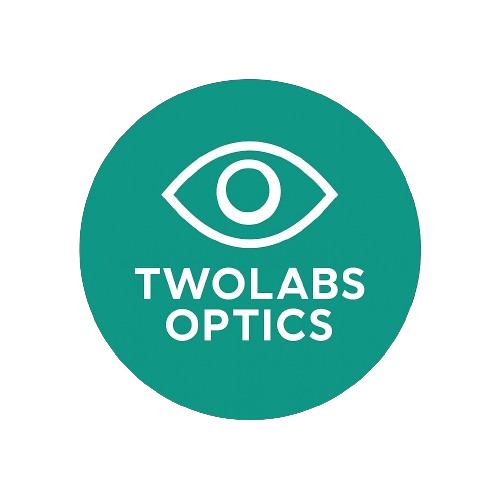
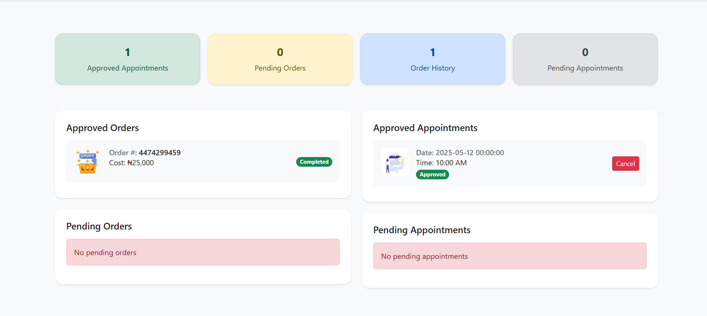
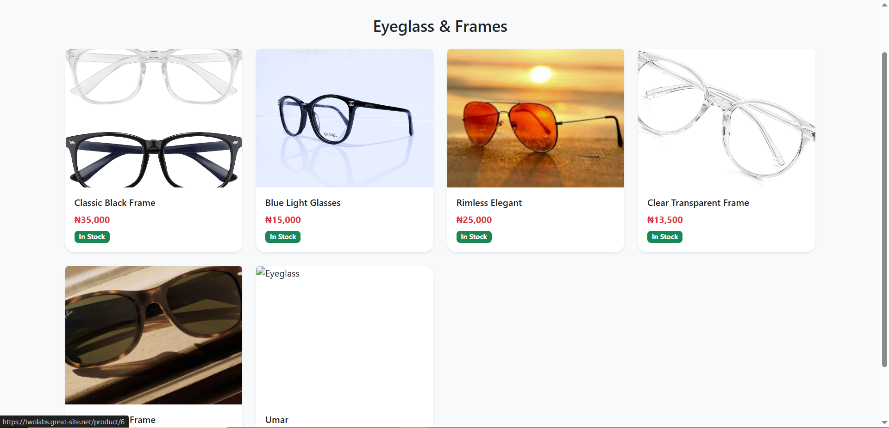
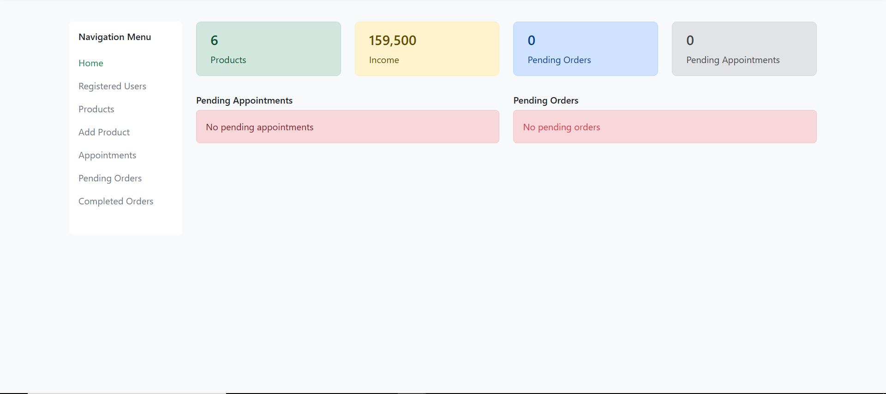
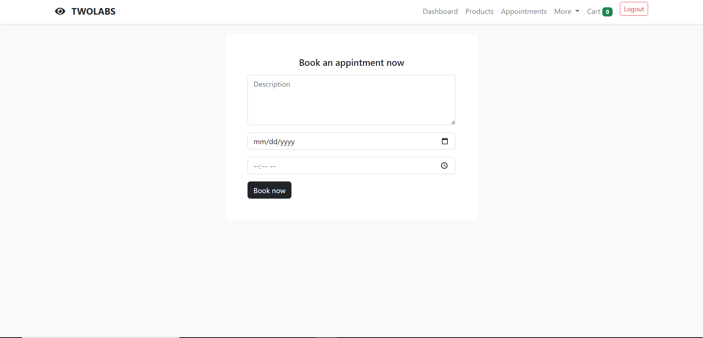

# 👁️ Web-Based Eye Clinic Management System



This project is a user-friendly, web-based management system designed specifically for **eye clinics**. Built using the **Laravel PHP framework**, the application helps streamline daily operations such as **booking appointments**, **managing product inventory**, **processing orders**, and **communicating with patients**.

The system was developed as part of our Bachelor’s degree final year project at **Lincoln University College**, with a real-world use case from **TwoLabs Optics**.

---

## 🚀 What the System Can Do

✅ **Browse Optical Products** – Glasses, lenses, frames, and more  
✅ **Book Appointments** – Select preferred dates and times  
✅ **Cart and Checkout** – Add products, simulate payments, place orders  
✅ **Admin Dashboard** – View all bookings and manage orders/products  
✅ **Email Alerts** – Get notified when bookings or orders are confirmed  
✅ **Authentication** – Secure login for users and admins

---

## 🛠️ Technologies Used

- **Laravel** (PHP framework)
- **MySQL** (Relational Database)
- **Bootstrap 5** (For responsive design)
- **Blade** (Laravel's templating engine)
- **JavaScript** (Client-side interactivity)
- **Monnify API** (Test-mode payment integration)
- **XAMPP** (Local server environment)

---

## 🧪 How to Set It Up

### Prerequisites
- PHP 8+
- Composer
- MySQL/MariaDB
- Node.js and NPM
- Git

### Setup Instructions
```bash
# Clone the repo
git clone https://github.com/your-username/eye-clinic-management.git
cd eye-clinic-management

# Install dependencies
composer install

# Set up environment
cp .env.example .env
php artisan key:generate

# Configure your database in the .env file
php artisan migrate --seed

# Install frontend dependencies
npm install && npm run dev

# Start the application
php artisan serve
```

---

## 📸 Screenshots

| Page | Description |
|------|-------------|
|  | View appointments, orders, and notifications |
|  | Browse products and add to cart |
|  | Manage products, bookings, and orders |
|  | Book an appointment with your optometrist |

> 🖼️ **Add your screenshots in the `/screenshots` folder.**

---

## 📂 Project Structure (Simplified)

```
├── app/                  # Backend logic
├── routes/               # Web routes
├── resources/views/      # Blade templates
├── public/               # Assets and entry point
├── database/migrations/  # DB structure
├── .env.example          # Environment config template
```

---

## 👨‍🎓 Developed By

- **Adam Sani**  
- **Abdallah Abdulrahman**

🎓 **Bachelor’s Degree in Computer Science**  
**Lincoln University College**

---

## 🎓 Supervised By

**Mr. Umar Shehu Abdulwahab**  
Department of Computer Science  
Lincoln University College

---

## 📬 Special Thanks

This project is based on a real-world case study of **TwoLabs Optics**, an eye clinic committed to digital transformation in healthcare. We thank them for their cooperation, support, and practical insights throughout the development process.

---

## 📃 License

This project is intended for academic purposes. Feel free to adapt and extend it with credit.
